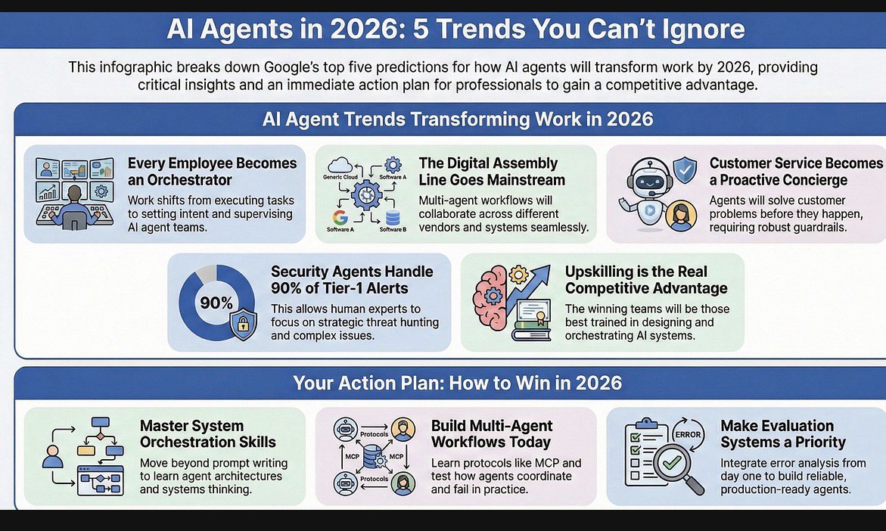

This is Jarvis, the BA documentation Agent

This is an educational example. 

Details about how to build it for your own purpose (in < than 1 hour) and insights about where and how to run it can be experienced in the
[certificate of advanced studies in Business Analysis and Methods](https://www.zhaw.ch/de/sml/weiterbildung/detail/kurs/cas-business-analysis-and-methods) at the [ZHAW School of Management and Law](https://www.zhaw.ch/en/university). 

See you there! 🙋‍♂️

