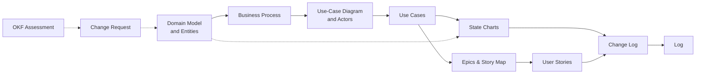

# OKF Product Documentation – ATM System

> [!NOTE] v1.6 – Changed 2026-09-13
> The repository is now *okf-productdocumentation*, step 2 of a two-step series; *What this is* and *Learn more* link step 1.

> [!NOTE] v1.7 – Changed 2026-09-13
> The page leads with the Open Knowledge Format; Jarvis is named as the agent that helps with the requirements analysis.

## What this is

The product documentation of an imaginary **ATM system**, kept as an
[Open Knowledge Format](https://github.com/GoogleCloudPlatform/knowledge-catalog/blob/main/okf/SPEC.md)
(OKF) bundle. Every page is a concept with a declared type, the artifacts it derives from
(`sources`), who wrote it and when (`generated`), and whether a person approved it (`verified`) — so
a reader can follow the documentation from domain model to user story, and any agent that reads OKF
can consume it without special tools.

It is an educational case for the [CAS Business Analysis and Methods](https://www.zhaw.ch/de/sml/weiterbildung/detail/kurs/cas-business-analysis-and-methods)
at the ZHAW, served from [github.com/marcelRonner/okf-productdocumentation](https://github.com/marcelRonner/okf-productdocumentation),
and **step 2** of a two-step series. Step 1, [okf-llm-wiki](https://github.com/marcelRonner/okf-llm-wiki),
shows the basics on a simple knowledge wiki; this repository applies the same ideas to the
documentation of a software product.

Every change starts as a **change request** in [Sources](sources/_index.md). **Jarvis**, an AI
agent, helps with the requirements analysis: it works out which artifacts a change affects, asks
about what is unclear, updates them from the domain model outward and records the version in the
[Change Log](change_log/changeLog.md). A person decides what changes and approves the result. Each
check of the bundle against OKF is filed in Sources too, and the change request that fixes a finding
cites it.

## Artifacts

- [**Domain Model**](domain_model/domainModel.md) — Core business entities and their relationships
  - [Entities](domain_model/entities/_index.md) — One page per business entity
- [**Business Process**](business_process/businessProcess.md) — End-to-end ATM interaction flow with embedded diagram
- [**Use-Case Diagram**](use_case/useCaseDiagram.md) — Actor–system interactions derived from the business process
  - [Actor Descriptions](use_case/actorDescriptions.md) — Detailed actor profiles and system access
  - [Actors](use_case/actors/_index.md) — One page per actor
  - [Authenticate](use_case/authenticate/authenticate.md) — Card & PIN authentication flow
  - [Withdraw Cash](use_case/withdraw_cash/withdrawCash.md) — Cash withdrawal flow
  - [Check Balance](use_case/check_balance/checkBalance.md) — Balance inquiry flow
  - [Transfer Funds](use_case/transfer_funds/transferFunds.md) — Fund transfer flow
  - [Print Receipt](use_case/print_receipt/printReceipt.md) — Optional receipt printing
- [**State Charts**](state_chart/transactionStateChart.md) — Entity lifecycle diagrams traced to use case activities
  - [Transaction](state_chart/transactionStateChart.md) — PENDING → COMPLETED / FAILED lifecycle
- [**Epics & Story Map**](epics/epics.md) — Work breakdown into epics with release-grouped user stories
  - [User Stories](epics/user_stories/_index.md) — 16 stories in 3C format across 3 releases
- [**Change Log**](change_log/changeLog.md) — Version history with full artifact traceability
- [**Sources**](sources/_index.md) — The change requests the documentation derives from, and the conformance assessments behind them
- [**Log**](log.md) — Every version and every assessment, newest first, in Open Knowledge Format

## How the artifacts interlink

The artifacts form one derivation chain: each is derived from the one before it, so a change never
stays local — it travels *downstream*. Work outward from the domain model. Every page also records
its arrows in its `sources:` frontmatter, so a tool can follow the chain as well as a reader.

### Join keys

Traceability is carried by a handful of identifiers, quoted verbatim across artifacts — renaming one
silently breaks every reference to it.

| Join key | Format | Defined in | Quoted by |
|---|---|---|---|
| Business process step | `4a.1`, `4a.3a` | [Business Process](business_process/businessProcess.md) | Use cases, the **BP Steps** row of the [story map](epics/epics.md) |
| Activity label | `Bank Backend updates Transaction (status = COMPLETED)` | Use case activity diagrams (`.puml`) | [State chart](state_chart/transactionStateChart.md) transitions, user story *Conversation* |
| Story ID | `US-{epic}.{seq}` | [User Stories](epics/user_stories/_index.md) | [Story map](epics/epics.md) cells, change log rows |
| Entity and attribute | `Transaction`, `status` | [Entities](domain_model/entities/_index.md) | Every artifact, and its `tags` |
| Source id | `business-process`, `cr-1-4` | Each artifact's `sources:` | That artifact's footnotes |
| Check ID | `OKF-SRC-02` | The check register, `.claude/skills/okf-check/okf-v0-2-checks.md` | [Assessments](sources/_index.md), and the change requests that fix their findings |

### When this changes, review these

| Changed | Also review |
|---|---|
| **Entity** — attribute or enum value | Business process labels · use case pre- and postconditions · the state chart of any entity with a `status` enum · user story *Confirmation* criteria |
| **Business process** — new or renumbered step | Use case traceability references · the **BP Steps** row of the story map · a new use case, if a new branch appeared |
| **Use-case diagram** — new use case | A new `use_case/{snake_case}/` folder with `.md` and `.puml` · exactly one matching epic · the artifact list above |
| **Activity diagram** — changed action label | Every state chart transition quoting it · every user story citing it |
| **State chart** — new state | The entity's enum must already contain it · a use case activity must trigger it, otherwise list it under *States Not Covered* |
| **Story map** — new story | A new `us_{epic}_{seq}.md` file · its cell in the story map |
| **Anything** | A change request in [Sources](sources/_index.md) · a row in the [Change Log](change_log/changeLog.md) · `make build` passes |

`make build` checks the mechanical half: frontmatter, links and footnotes, and that every diagram
renders. The rest is review.

## Learn more

- [How this repository works](https://www.wlrm.ch/okf-productdocumentation/) — the pieces and how a change flows through them, in plain language
- [README](https://github.com/marcelRonner/okf-productdocumentation#readme) — setting the repository up, building and deploying it
- [Open Knowledge Format](https://github.com/GoogleCloudPlatform/knowledge-catalog/blob/main/okf/SPEC.md) — the specification the frontmatter on every page follows
- [okf-llm-wiki](https://github.com/marcelRonner/okf-llm-wiki) — step 1 of the series: the same ideas on a simple knowledge wiki
- [Jarvis's instructions](https://github.com/marcelRonner/okf-productdocumentation/blob/main/AGENTS.md) — the contract the requirements-analysis agent works under
- [LLM Wiki](https://gist.github.com/karpathy/442a6bf555914893e9891c11519de94f) — the pattern behind it: an agent compiling sources into linked, maintained pages
