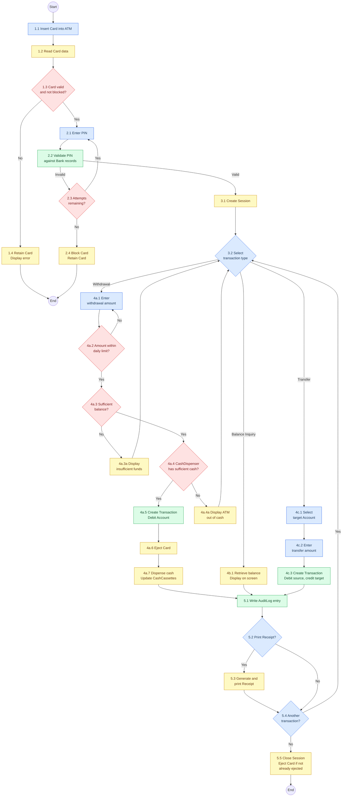

# Business Process – ATM Cash Withdrawal & Services

## Overview

This business process describes the end-to-end flow of a customer interacting with an ATM, from card insertion and authentication through transaction execution (withdrawal, balance inquiry, or transfer) to session completion. It references the entities defined in the [Domain Model](../domain_model/domainModel.md).

---

## Process Diagram

**Legend:** 🟦 Customer &nbsp; 🟨 ATM System &nbsp; 🟩 Bank Backend &nbsp; 🟥 Decision

