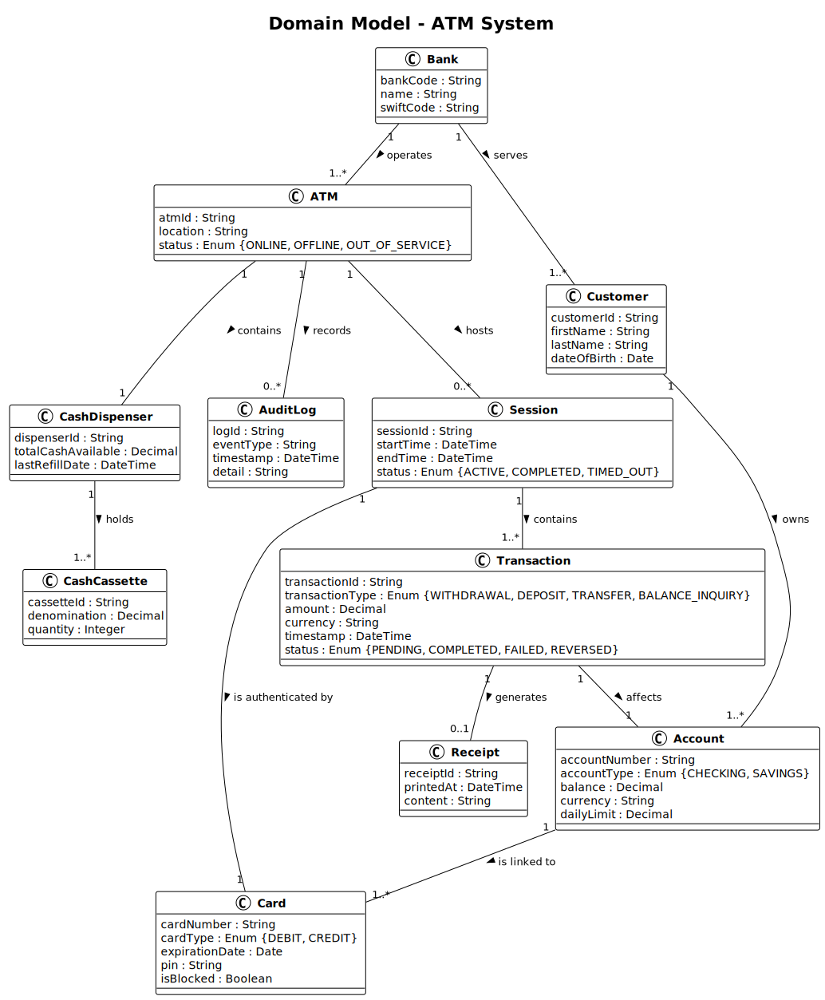

# Domain Model – ATM System

## Overview

This domain model describes the core business entities and their relationships for an IT system that realizes an Automated Teller Machine (ATM).

---

## Class Diagram

---

## Classes

### ATM
Represents a physical ATM terminal deployed at a specific location.

| Attribute       | Type     | Description                          |
|-----------------|----------|--------------------------------------|
| atmId           | String   | Unique identifier of the ATM        |
| location        | String   | Physical address of the ATM         |
| status          | Enum     | ONLINE, OFFLINE, OUT_OF_SERVICE     |

---

### Bank
Represents a financial institution that owns or operates ATMs and manages customer accounts.

| Attribute       | Type     | Description                          |
|-----------------|----------|--------------------------------------|
| bankCode        | String   | Unique bank identification code     |
| name            | String   | Name of the bank                    |
| swiftCode       | String   | SWIFT/BIC code for interbank comm.  |

---

### Customer
Represents an individual who holds one or more accounts at a bank.

| Attribute       | Type     | Description                          |
|-----------------|----------|--------------------------------------|
| customerId      | String   | Unique identifier of the customer   |
| firstName       | String   | First name                          |
| lastName        | String   | Last name                           |
| dateOfBirth     | Date     | Date of birth                       |

---

### Account
Represents a bank account owned by a customer.

| Attribute       | Type     | Description                          |
|-----------------|----------|--------------------------------------|
| accountNumber   | String   | Unique account number               |
| accountType     | Enum     | CHECKING, SAVINGS                   |
| balance         | Decimal  | Current account balance             |
| currency        | String   | Currency code (e.g. CHF, EUR)       |
| dailyLimit      | Decimal  | Maximum daily withdrawal amount     |

---

### Card
Represents a physical debit or credit card linked to an account.

| Attribute       | Type     | Description                          |
|-----------------|----------|--------------------------------------|
| cardNumber      | String   | Unique card number                  |
| cardType        | Enum     | DEBIT, CREDIT                       |
| expirationDate  | Date     | Card expiry date                    |
| pin             | String   | Encrypted PIN                       |
| isBlocked       | Boolean  | Whether the card is blocked         |

---

### Session
Represents an active interaction between a customer and an ATM.

| Attribute       | Type     | Description                          |
|-----------------|----------|--------------------------------------|
| sessionId       | String   | Unique session identifier           |
| startTime       | DateTime | When the session started            |
| endTime         | DateTime | When the session ended              |
| status          | Enum     | ACTIVE, COMPLETED, TIMED_OUT        |

---

### Transaction
Represents a financial operation performed during a session.

| Attribute        | Type     | Description                          |
|------------------|----------|--------------------------------------|
| transactionId    | String   | Unique transaction identifier       |
| transactionType  | Enum     | WITHDRAWAL, DEPOSIT, TRANSFER, BALANCE_INQUIRY |
| amount           | Decimal  | Transaction amount                  |
| currency         | String   | Currency code                       |
| timestamp        | DateTime | When the transaction was executed   |
| status           | Enum     | PENDING, COMPLETED, FAILED, REVERSED|

---

### Receipt
Represents a printed or digital receipt issued after a transaction.

| Attribute       | Type     | Description                          |
|-----------------|----------|--------------------------------------|
| receiptId       | String   | Unique receipt identifier           |
| printedAt       | DateTime | When the receipt was generated      |
| content         | String   | Formatted receipt text              |

---

### CashDispenser
Represents the cash-dispensing hardware unit inside an ATM.

| Attribute          | Type     | Description                          |
|--------------------|----------|--------------------------------------|
| dispenserId        | String   | Unique dispenser identifier         |
| totalCashAvailable | Decimal  | Total cash remaining in the unit    |
| lastRefillDate     | DateTime | Date of last cash refill            |

---

### CashCassette
Represents a single cassette holding banknotes of a specific denomination.

| Attribute       | Type     | Description                          |
|-----------------|----------|--------------------------------------|
| cassetteId      | String   | Unique cassette identifier          |
| denomination    | Decimal  | Banknote value (e.g. 10, 20, 100)  |
| quantity        | Integer  | Number of banknotes in the cassette |

---

### AuditLog
Represents a record of system events for security and compliance purposes.

| Attribute       | Type     | Description                          |
|-----------------|----------|--------------------------------------|
| logId           | String   | Unique log entry identifier         |
| eventType       | String   | Type of event logged                |
| timestamp       | DateTime | When the event occurred             |
| detail          | String   | Descriptive detail of the event     |

---

