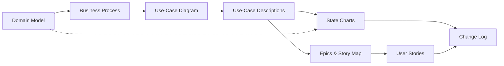

# ATM System Documentation

!!! note "v1.3 – Added 2026-08-01"
    New section: *How the artifacts interlink* — the dependency chain, the join keys, and what to review when something changes.

Welcome to the documentation for the **ATM example system**.
This is a demo case that is served from [https://github.com/marcelRonner/jarvis](https://github.com/marcelRonner/jarvis) and is only for educational purposes. Reach out to the author in case of questions.

## Artifacts

- [**Domain Model**](domain_model/domainModel.md) — Core business entities and their relationships
- [**Business Process**](business_process/businessProcess.md) — End-to-end ATM interaction flow with embedded diagram
- [**Use-Case Diagram**](use_case/useCaseDiagram.md) — Actor–system interactions derived from the business process
  - [Actor Descriptions](use_case/actorDescriptions.md) — Detailed actor profiles and system access
  - [Authenticate](use_case/authenticate/authenticate.md) — Card & PIN authentication flow
  - [Withdraw Cash](use_case/withdraw_cash/withdrawCash.md) — Cash withdrawal flow
  - [Check Balance](use_case/check_balance/checkBalance.md) — Balance inquiry flow
  - [Transfer Funds](use_case/transfer_funds/transferFunds.md) — Fund transfer flow
  - [Print Receipt](use_case/print_receipt/printReceipt.md) — Optional receipt printing
- [**State Charts**](state_chart/transactionStateChart.md) — Entity lifecycle diagrams traced to use case activities
  - [Transaction](state_chart/transactionStateChart.md) — PENDING → COMPLETED / FAILED lifecycle
- [**Epics & Story Map**](epics/epics.md) — Work breakdown into epics with release-grouped user stories
  - [User Stories](epics/user_stories/us_1_1.md) — 16 stories in 3C format across 3 releases
- [**Change Log**](change_log/changeLog.md) — Version history with full artifact traceability

## How the artifacts interlink

The artifacts form a single derivation chain. Each one is derived from the one before it, so a
change never stays local — it propagates *downstream*. Work outward from the domain model.

### Join keys

Traceability is carried by three identifiers. They are quoted verbatim across artifacts, so
renaming one silently breaks every reference to it.

| Join key | Format | Defined in | Quoted by |
|---|---|---|---|
| Business process step ID | `4a.1`, `4a.3a` | [Business Process](business_process/businessProcess.md) | Use-case descriptions, the **BP Steps** row of the [story map](epics/epics.md) |
| Activity label | `:Bank Backend updates Transaction\n(status = COMPLETED);` | Use-case activity diagrams (`.puml`) | [State chart](state_chart/transactionStateChart.md) transition tables, user story *Conversation* sections |
| Story ID | `US-{epic}.{seq}` | [User Stories](epics/user_stories/us_1_1.md) | [Story map](epics/epics.md) cells, change log rows |
| Entity & attribute names | `Transaction`, `status` | [Domain Model](domain_model/domainModel.md) | Every other artifact |

### Impact rules — when this changes, check these

| Changed artifact | Must also review |
|---|---|
| **Domain model** — class, attribute, or enum value | Business process labels · use-case pre/postconditions · state charts for any entity with an enum `status` · user story *Confirmation* criteria |
| **Business process** — new/renumbered step | Use-case traceability references · the **BP Steps** row of the story map · possibly a new use case if a new branch was added |
| **Use-case diagram** — new use case | New `use_case/{snake_case}/` folder with `.md` + `.puml` · a matching epic (exactly one) · `mkdocs.yml` nav · this page |
| **Use-case activity diagram** — changed `:action;` label | Every state-chart transition table quoting it · every user story citing it |
| **State chart** — new state | The domain model enum must already contain it · a use-case activity must trigger it, otherwise list it under *States Not Covered* |
| **Epics / story map** — new story | New `us_{epic}_{seq}.md` file · a cell in the story map · `mkdocs.yml` nav |
| **Any of the above** | A row in the [Change Log](change_log/changeLog.md) · `make lint` passes |

Run `make lint` to verify the mechanical half of these rules (link integrity, nav coverage,
diagram naming, story-map coverage, activity-label matching).
