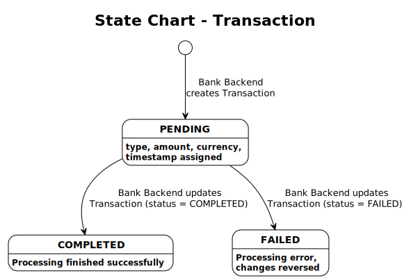

# State Chart – Transaction

## Overview

This state chart shows how the `status` attribute of the [Transaction](../domain_model/domainModel.md#transaction) entity changes through activities defined in the [Use-Case Descriptions](../use_case/useCaseDiagram.md). Every transition is backed by a specific activity in a use case — no state can be reached without it.

---

## Diagram

---

## States

| State | Description |
|-------|-------------|
| **PENDING** | The Transaction has been created. The `transactionType`, `amount`, `currency`, and `timestamp` are assigned. Processing has not yet finished. |
| **COMPLETED** | All processing steps finished successfully. The AuditLog entry has been written. |
| **FAILED** | Processing could not be completed. Any Account changes have been reversed. The AuditLog entry has been written. |

---

## Transition Traceability

Every transition below maps to an explicit activity (`:action;`) in a use case activity diagram.

| Transition | Trigger Activity | Use Case | Activity Diagram Step |
|---|---|---|---|
| [*] → PENDING | "Bank Backend creates Transaction (status = PENDING)" | [Withdraw Cash](../use_case/withdraw_cash/withdrawCash.md) | After all pre-checks pass |
| [*] → PENDING | "Bank Backend creates Transaction (status = PENDING)" | [Transfer Funds](../use_case/transfer_funds/transferFunds.md) | After Customer enters transfer amount |
| [*] → PENDING | "Bank Backend creates Transaction (status = PENDING)" | [Check Balance](../use_case/check_balance/checkBalance.md) | At the start of the inquiry |
| PENDING → COMPLETED | "Bank Backend updates Transaction (status = COMPLETED)" | [Withdraw Cash](../use_case/withdraw_cash/withdrawCash.md) | After cash dispensed successfully |
| PENDING → COMPLETED | "Bank Backend updates Transaction (status = COMPLETED)" | [Transfer Funds](../use_case/transfer_funds/transferFunds.md) | After accounts updated successfully |
| PENDING → COMPLETED | "Bank Backend updates Transaction (status = COMPLETED)" | [Check Balance](../use_case/check_balance/checkBalance.md) | After balance displayed |
| PENDING → FAILED | "Bank Backend updates Transaction (status = FAILED)" | [Withdraw Cash](../use_case/withdraw_cash/withdrawCash.md) | On cash dispensing failure |
| PENDING → FAILED | "Bank Backend updates Transaction (status = FAILED)" | [Transfer Funds](../use_case/transfer_funds/transferFunds.md) | On transfer processing error |

---

## States Not Covered

The domain model defines a **REVERSED** status for Transaction. This state is not currently triggered by any use case activity. A future "Reverse Transaction" use case would be needed to model the `COMPLETED → REVERSED` transition.
