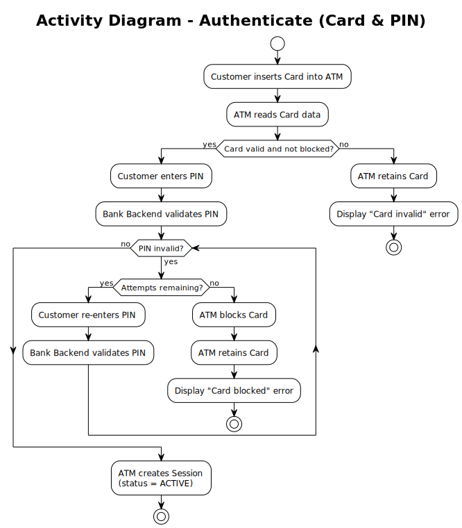

# Use Case – Authenticate (Card & PIN)

## Overview

This use case describes the authentication flow that every ATM interaction must pass through before a Transaction can be performed. It corresponds to **Business Process steps 1.1 – 3.1**. See also the [Use-Case Diagram](../useCaseDiagram.md) and the [Business Process](../../business_process/businessProcess.md).

---

## Preconditions

- The ATM status is `ONLINE`
- The Customer possesses a physical Card linked to an Account
- No Session is currently active on the ATM

## Postconditions

**Success:**
- A Session with status `ACTIVE` has been created
- The Card has been authenticated against Bank Backend records

**Failure – invalid Card:**
- The Card is retained by the ATM
- An error message is displayed
- No Session is created

**Failure – PIN attempts exhausted:**
- The Card `isBlocked` is set to `true`
- The Card is retained by the ATM
- No Session is created

---

## Description

The Customer inserts their Card into the ATM. The ATM reads the Card data and validates that the Card is not expired and not blocked. If the Card is invalid, it is retained and an error is shown. If the Card is valid, the Customer is prompted to enter their PIN. The Bank Backend verifies the PIN. On an invalid PIN the Customer may retry up to the maximum number of attempts; if all attempts are exhausted the Card is blocked and retained. On a valid PIN the ATM creates a new Session.

---

## Activity Diagram

