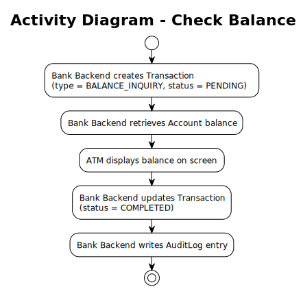

# Use Case – Check Balance

## Overview

This use case describes the balance inquiry flow at an ATM. It corresponds to **Business Process step 4b.1**. See also the [Use-Case Diagram](../useCaseDiagram.md) and the [Business Process](../../business_process/businessProcess.md).

---

## Preconditions

- A Session with status `ACTIVE` exists (Customer is authenticated)
- The Customer has selected "Balance Inquiry" as the transaction type

## Postconditions

- A Transaction of type `BALANCE_INQUIRY` is created with status `PENDING`
- The current Account balance has been displayed on the ATM screen
- The Transaction status is updated to `COMPLETED`
- An AuditLog entry has been created
- The Account balance is unchanged

---

## Description

The Customer selects a balance inquiry. The Bank Backend creates a Transaction with status `PENDING` and retrieves the current balance from the Account. The ATM displays the balance on screen. The Transaction is updated to `COMPLETED` and an AuditLog entry is written. See also the [Transaction State Chart](../../state_chart/transactionStateChart.md).

---

## Activity Diagram

