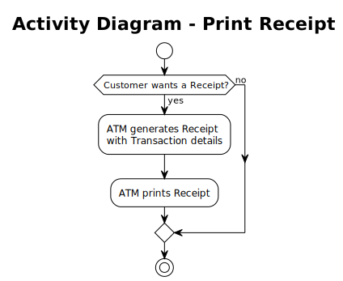

# Use Case – Print Receipt

## Overview

This use case describes the optional receipt printing flow after any ATM Transaction. It corresponds to **Business Process steps 5.2 – 5.3**. See also the [Use-Case Diagram](../useCaseDiagram.md) and the [Business Process](../../business_process/businessProcess.md).

---

## Preconditions

- A Transaction has been completed in the current Session
- The ATM receipt printer is operational

## Postconditions

**Customer chooses to print:**
- The ATM retrieves the current Account `balance`
- A Receipt is generated containing the Transaction details and the current Account `balance`
- The Receipt is physically printed and handed to the Customer

**Customer declines:**
- No Receipt is generated; the flow continues to the next step

---

## Description

After completing a Transaction (withdrawal, balance inquiry, or transfer), the ATM asks the Customer whether they want a printed Receipt. If the Customer accepts, the ATM retrieves the current Account `balance`, generates a Receipt with the Transaction details and the Account `balance`, and prints it. If the Customer declines, the flow continues without printing.

---

## Activity Diagram

