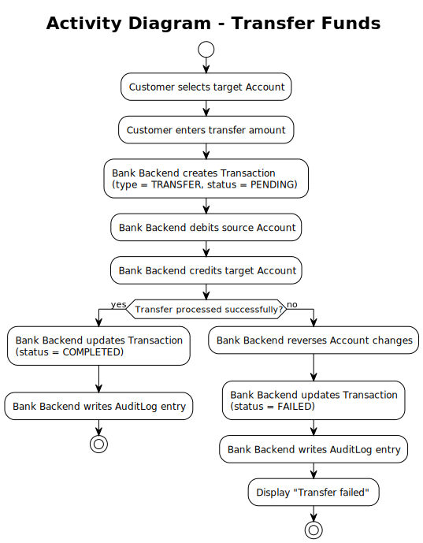

# Use Case – Transfer Funds

## Overview

This use case describes the fund transfer flow at an ATM. It corresponds to **Business Process steps 4c.1 – 4c.3**. See also the [Use-Case Diagram](../useCaseDiagram.md) and the [Business Process](../../business_process/businessProcess.md).

---

## Preconditions

- A Session with status `ACTIVE` exists (Customer is authenticated)
- The Customer has selected "Transfer" as the transaction type

## Postconditions

**Success:**
- A Transaction of type `TRANSFER` is created with status `PENDING`
- After successful processing, the Transaction status is updated to `COMPLETED`
- The source Account balance is debited by the transfer amount
- The target Account balance is credited by the transfer amount
- An AuditLog entry has been created

**Failure – processing error:**
- A Transaction is created with status `PENDING`
- The Transaction status is updated to `FAILED`
- Account changes are reversed
- An AuditLog entry has been created
- Customer is informed of the error

---

## Description

The Customer selects the target Account for the transfer. The Customer enters the desired transfer amount. The Bank Backend creates a Transaction with status `PENDING`, debits the source Account, and credits the target Account. If all operations succeed, the Transaction is updated to `COMPLETED` and an AuditLog entry is written. If processing fails, Account changes are reversed and the Transaction is updated to `FAILED`. See also the [Transaction State Chart](../../state_chart/transactionStateChart.md).

---

## Activity Diagram

