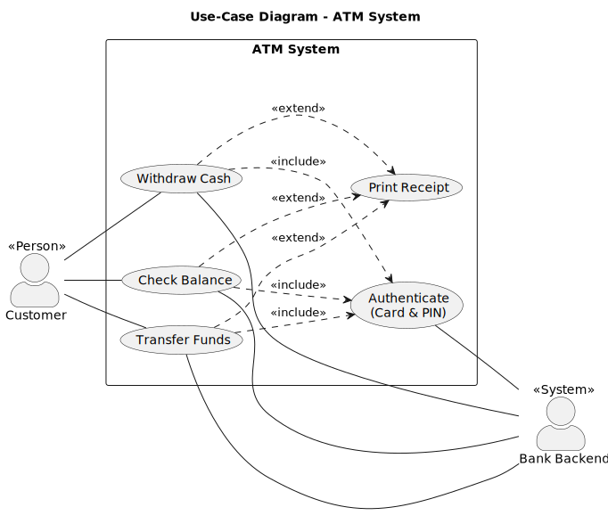

# Use-Case Diagram – ATM System

## Overview

This use-case diagram shows how the actors identified in the [Business Process](../business_process/businessProcess.md) interact with the ATM system. Each use case represents a goal an actor wants to achieve.

---

## Diagram

---

## Actors

| Actor | Type | Description |
|-------|------|-------------|
| **Customer** | Primary | A bank customer who uses the ATM to perform financial transactions (see 🟦 Customer in the Business Process). |
| **Bank Backend** | Supporting | The banking system that validates credentials, processes transactions, and records audit logs (see 🟩 Bank Backend in the Business Process). |

---

## Use Cases

### Withdraw Cash
The customer withdraws a specified amount of cash from their account. The ATM ejects the Card before dispensing cash to prevent the Customer from forgetting it.
Corresponds to **Business Process steps 4a.1 – 4a.7** (enter amount → check limits & funds → eject Card → dispense cash).

### Check Balance
The customer views the current balance of their account on screen.
Corresponds to **Business Process step 4b.1** (retrieve and display balance).

### Transfer Funds
The customer transfers money from their account to another account.
Corresponds to **Business Process steps 4c.1 – 4c.3** (select target account → enter amount → execute transfer).

### Authenticate (Card & PIN)
The customer inserts their card and enters their PIN; the Bank Backend validates the credentials and the ATM creates a session. This is **included** by every main use case — no transaction can proceed without successful authentication.
Corresponds to **Business Process steps 1.1 – 3.1** (insert card → validate card → enter PIN → validate PIN → create session).

### Print Receipt
After any transaction the customer may choose to print a receipt. This **extends** every main use case as an optional step.
Corresponds to **Business Process steps 5.2 – 5.3** (receipt choice → generate and print receipt).

---

## Relationships

| Relationship | Type | Description |
|---|---|---|
| Withdraw Cash → Authenticate | `<<include>>` | Authentication is mandatory before a withdrawal. |
| Check Balance → Authenticate | `<<include>>` | Authentication is mandatory before a balance inquiry. |
| Transfer Funds → Authenticate | `<<include>>` | Authentication is mandatory before a transfer. |
| Withdraw Cash → Print Receipt | `<<extend>>` | The customer may optionally print a receipt after a withdrawal. |
| Check Balance → Print Receipt | `<<extend>>` | The customer may optionally print a receipt after a balance inquiry. |
| Transfer Funds → Print Receipt | `<<extend>>` | The customer may optionally print a receipt after a transfer. |
