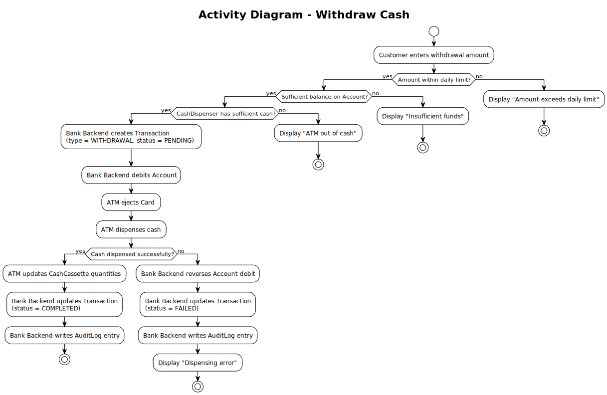

# Use Case – Withdraw Cash

## Overview

This use case describes the cash withdrawal flow at an ATM. It corresponds to **Business Process steps 4a.1 – 4a.7**. See also the [Use-Case Diagram](../useCaseDiagram.md) and the [Business Process](../../business_process/businessProcess.md).

---

## Preconditions

- A Session with status `ACTIVE` exists (Customer is authenticated)
- The Customer has selected "Withdrawal" as the transaction type

## Postconditions

**Success:**
- A Transaction of type `WITHDRAWAL` is created with status `PENDING`
- The Card is ejected before cash dispensing
- After successful cash dispensing, the Transaction status is updated to `COMPLETED`
- The Account balance is debited by the withdrawal amount
- Cash has been physically dispensed via the CashDispenser
- CashCassette quantities are updated
- An AuditLog entry has been created

**Failure – dispensing error:**
- A Transaction is created with status `PENDING`
- The Transaction status is updated to `FAILED`
- The Account debit is reversed
- An AuditLog entry has been created
- Customer is informed of the error

**Failure – insufficient funds:**
- No Transaction is created, Account balance unchanged
- Customer is informed and returned to the transaction selection

**Failure – ATM out of cash:**
- No Transaction is created, Account balance unchanged
- Customer is informed and returned to the transaction selection

---

## Description

The Customer enters the desired withdrawal amount. The system checks whether the amount is within the Account `dailyLimit`. If not, the Customer is informed. Next the Bank Backend verifies that the Account has sufficient balance. If funds are insufficient, an error is shown. The ATM then checks whether the CashDispenser holds enough cash. If all checks pass, the Bank Backend creates a Transaction with status `PENDING`, debits the Account, and the ATM ejects the Card. Once the Customer retrieves the Card, the ATM dispenses cash. On successful dispensing the Transaction is updated to `COMPLETED`, CashCassette quantities are adjusted, and an AuditLog entry is written. If dispensing fails, the Account debit is reversed and the Transaction is updated to `FAILED`. The Session remains `ACTIVE` so the Customer can perform another transaction (requiring Card re-insertion). See also the [Transaction State Chart](../../state_chart/transactionStateChart.md).

---

## Activity Diagram

